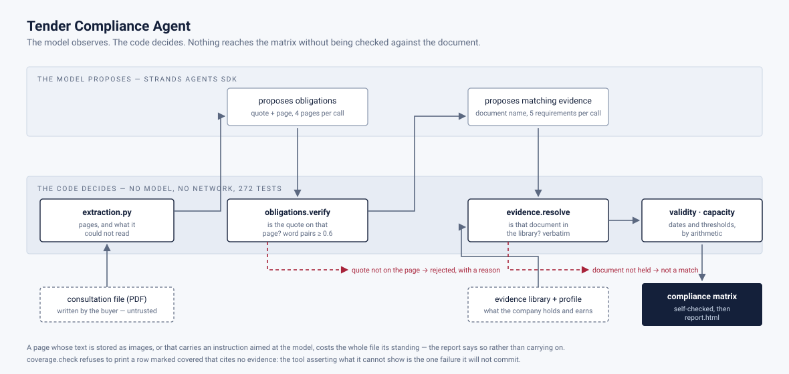

# Tender Compliance Agent

**Public bids are rejected on paperwork before anyone reads them. This agent finds the gaps first.**

<p align="center">
  
</p>

Built for the [Agents for Humans](https://agentsforhumans.devpost.com) hackathon — Professional Agent track.

---

## The problem

A public tender pack runs 150 to 200 pages. Buried in it are dozens of
administrative obligations: certificates to attach, insurance minimums to meet,
turnover thresholds to prove, references to supply, forms to sign.

A bid that misses one of them is **rejected before anyone reads the offer
itself**. Not outbid — rejected. The price, the method, the team: never
evaluated. A small firm loses the tender on an insurance attestation that
expired eleven days before the submission date.

Nobody catches this by reading. The obligations are scattered across four or
five documents, they use different words for the same requirement, and the ones
that matter most — dates — are the ones a human eye is worst at checking.

## What it does

Give it a tender pack and your company's evidence library. It returns a
**compliance matrix**:

| | |
|---|---|
| **Covered** | the obligation is met, and here is the document that proves it |
| **Missing** | nothing in the library answers this |
| **Expired** | the document exists but will not be valid on the submission date |
| **Needs review** | a match was found, but it is not certain enough to assert |

Every row cites a page **on both sides** — the page of the tender pack that
states the obligation, and the page of the evidence that answers it. A claim
you cannot trace is a claim you cannot defend.

It also produces the list of documents to obtain, with the deadline each one
must beat.

## What it deliberately does not do

- **It does not decide whether to bid.** It produces evidence and gaps; the
  decision stays with a human who knows things the documents do not.
- **It does not price anything.**
- **It does not submit anything.**
- **It never asserts a capability the company cannot prove.** If a draft
  paragraph would need a claim no document backs, the claim is flagged, not
  written.

## Architecture



Two bands, and the whole argument is that nothing crosses from left to right
without dropping into the lower one. The model proposes twice — obligations,
then matching evidence — and each proposal is checked against the document or
the library before it may continue. Dates and thresholds never reach it at all.

## The rule that shapes the architecture

**The model observes, the code decides.**

The language model reads documents and proposes interpretations — it is good at
that, and nothing else does it. But every consequence is computed by
deterministic code:

- **dates are never computed by the model.** Whether a certificate is valid on
  the submission date is arithmetic, and arithmetic that a model gets wrong
  looks exactly like arithmetic it gets right. See `validity.py`.
- **counts are never estimated by the model.** "31 of 47 covered" comes from
  counting, not from asking. See `coverage.py`.
- **evidence is matched with a citation or not at all.** A match that cannot
  name its page is downgraded to *needs review*, never to *covered*.

The result is a report that can be argued with. Every number can be checked by
hand, and every assertion points at the page it came from.

## Real tenders, a fabricated evidence library

**The tender packs are real** — public documents from BOAMP and TED, readable by
anyone. A tool that only works on documents written for it proves nothing.

**The evidence library is invented.** `samples/evidence_library.json` describes a
company that does not exist, holding certificates that do not exist. No real
firm's attestations appear anywhere in this repository.

Said plainly because the alternative is worse: a demonstration built on a real
company's compliance file would publish which of its certificates have lapsed,
and a reader who later discovered an undisclosed fabrication would be right to
doubt the rest of the report.

It is also the better engineering choice. The interesting cases are rare in any
one real folder and are exactly the ones the tool must be shown catching.
Authoring them makes the demonstration deterministic — the certificate that
expires nine days before the deadline does so on every machine, every time.
`tests/test_library.py` asserts each verdict still fires, so the fixture is
tested like code.

## What reading real notices changed

The design was written first, then two published notices were read — the
Ministry of Education's application-support framework and the City of Paris
datacenter contract. Both are quoted verbatim, with provenance, in
`samples/real_requirements.json`.

They broke the design in a way the specification could not have shown, because
the specification was written by someone imagining how buyers write.

**Not every obligation is answered by a document.**

> « Le candidat donne toutes les informations permettant de justifier de son
> chiffre d'affaires annuel global moyen sur les trois derniers exercices »
> — « si x est strictement supérieur à 3 124 998 d'euros HT : 2/2 »

No paper satisfies that. No expiry date decides it. It is a number against a
threshold, and the evidence matcher would have reported MISSING on a company
that meets it comfortably. Hence `capacity.py`.

**Buyers grade, they do not only admit.** `2/2` is a scoring grid: a bidder can
be admissible and still lose points. A status alone throws that away.

**One obligation, several satisfaction paths.**

> « Les prestations de services sont prouvées par des attestations du
> destinataire ou, à défaut, par une déclaration de l'opérateur économique. Ou
> PARTIE IV C 1b) du DUME. »

Three routes in one sentence. Reporting MISSING because the first is empty is
wrong, and wrong in the direction that wastes the bidder's time.

**Refusing a young company is usually not what the buyer wants.**

> « Pour les candidats dans l'impossibilité, à raison de leur création récente,
> de produire la liste de références susmentionnée, il est demandé tout autre
> moyen de preuve »

A firm with two years of accounts against a three-year window has not failed —
it falls on a different path. `capacity.py` returns *needs review* there, never
*missing*: the other error costs a bid that was winnable.

**An obligation can be two words.** « DC1, DC2 » is a complete requirement. An
extractor built on sentences walks straight past it.

## What reading the consultation files changed again

Notices are not where the requirements live. Since eForms became mandatory they
point at the *règlement de la consultation*, and that is the document a bidder
actually works from. Two were downloaded and committed under `samples/real_dce/`:

| File | Buyer | Deadline |
|---|---|---|
| `rc_ANTAI_2026.pdf` | Ministry of the Interior — ANTAI, IT outsourcing and user support | 28/10/2026 |
| `rc_2026SDCRH05.pdf` | Ministry of Transport — DGAC | 11/09/2026 |

### One of them cannot be read, and says nothing about it

Open page 13 of the ANTAI file in any viewer:

> « 2° **Une déclaration sur l'honneur** pour justifier qu'il n'entre dans aucun
> des cas mentionnés aux articles L. 2141-1 à L. 2141-5 […] »

Ask pypdf, pdfplumber or PyMuPDF for the same page and all three return:

```
2°
articles L. 2141-1 à L. 2141-5 et L. 2141-7 à L. 2141-
```

A mandatory document — no bid survives IV.9 without it — is perfectly legible
to a human and invisible to every extractor. Runs of text were rasterised into
image strips and pasted back in place: ten on that page, 261 across the file.

This is the worst possible failure for a tool of this kind. Not a wrong answer,
which someone would question, but a **confident and incomplete** one: the
checklist silently omits an obligation and reports nothing amiss.

So `extraction.py` asks a different question — *is any of this page a picture of
words* — and the answer is exact:

```
DGAC    0 image strips over 14 pages   (its one image is a letterhead)
ANTAI   261 strips over 34 pages       (10 of them on page 13)
```

Where text was hidden, the tool names the pages and **refuses to conclude that
anything is absent**. "The tender does not ask for X" and "we could not read the
part that asks for X" are different statements, and only one is safe to act on.

The first detector tried here counted glyphs drawn against characters returned.
It separated the two files cleanly, so it looked right — and it was wrong: the
glyph trace does not contain the missing words either. It was measuring section
headings and agreeing with the truth by coincidence. That is worse than failing,
because it would have held up in a demo and broken on the next file. The version
that shipped is the one whose mechanism was checked, not the one whose output
looked correct.

### And a threshold two orders of magnitude larger

> « ne retiendra que les candidats […] dont le chiffre d'affaires du dernier
> exercice disponible est supérieur ou égal à **138 000 000 euros hors taxe** »

One year rather than three, *supérieur ou égal* rather than *strictement
supérieur*. `capacity.py` needed no change — which is the point of having built
it against the first two notices before meeting this one.

### Four more gaps, recorded before writing the code that must handle them

- **Candidature and offre are two piles with different penalties.** An incomplete
  candidature is eliminated; an irregular offer may be regularised. The same
  missing paper is fatal in one and fixable in the other.
- **An obligation can be conditional** — « en cas de non-assujettissement à la
  TVA », « le cas échéant le DC4 ». Reporting those as missing for a bidder they
  do not concern is noise, and noise is how a report stops being read.
- **The buyer may already hold the proof.** Both files waive justificatifs
  obtainable free of charge from an official system.
- **A group multiplies the checklist but not the thresholds.** Every member of a
  groupement supplies the full document set, while capacity is assessed on the
  group as a whole.

All eleven gaps, with the sentence that revealed each, are in
`samples/real_requirements.json`.

## Status

Early. This repository was created for the hackathon and starts from zero.

| Module | State |
|---|---|
| `validity.py` — date arithmetic on evidence | implemented, tested |
| `coverage.py` — the compliance matrix and its counts | implemented, tested |
| `library.py` — loading a company's evidence library | implemented, tested |
| `capacity.py` — quantified thresholds against company facts | implemented, tested |
| `extraction.py` — reading a PDF, and knowing when it could not be read | implemented, tested |
| `model.py` — provider selection, Anthropic or OpenAI | implemented, tested |
| `tender.py` — the pipeline, and the agent that feeds it | implemented, tested |
| `__main__.py` — `python -m tender_compliance <pdf...>` | implemented |
| `batch.py` — a folder of consultation files in one command | implemented, tested |
| `obligations.py` — extracting obligations, and refusing unanchored ones | implemented, tested |
| `evidence.py` — matching evidence, and refusing to invent it | implemented, tested |
| `untrusted.py` — spotting text in a tender aimed at the model | implemented, tested |
| `report.py` — the self-contained HTML report | implemented, tested |

Sector chosen for the demonstration: **French public tenders for IT services**
(CPV 72xxxxxx). Shorter packs than construction, an evidence library that can be
modelled honestly, and both date rules occur naturally — professional indemnity
insurance carries an annual expiry, while tax and social-security attestations
are demanded "less than 6 months old".

## Quickstart

```bash
python -m pip install -r requirements.txt
python -m pytest tests/ -q                    # whole suite, no key, no network

cp .env.example .env                          # add ONE model key
python -m tender_compliance samples/real_dce/rc_ANTAI_2026.pdf \
  --deadline 2026-10-28 --html out/antai.html
```

A folder or a wildcard analyses every consultation file it holds, one report
each, and prints a closing line per document:

```bash
python -m tender_compliance samples/real_dce --html-dir out
```

Nothing is pooled across documents. Four tenders have four deadlines and four
matrices, and a combined obligation count would describe no tender that exists.
One document failing — an API call dropping mid-run does happen — costs that
document and no other; the summary names what failed and the exit code is
non-zero.

`python demo/walkthrough.py` runs the same thing shot by shot; the recording
script is in [docs/video.md](docs/video.md).

## Provenance and disclosures

Written for the [Agents for Humans](https://agentsforhumans.devpost.com)
hackathon, from an empty repository, first commit 23 August 2026 — inside the
submission period, which opened on 10 August.

**No pre-existing code is incorporated.** Every module here was written for this
submission. Dependencies are the ones in `requirements.txt`, used as published:
Strands Agents (the SDK the hackathon requires), PyMuPDF, and pytest.

**Third-party material, all public.** `samples/real_dce/` holds four
consultation files published by public buyers, all freely downloadable without
registration. Two French règlements de la consultation from the state
procurement platform — the Ministry of the Interior (ANTAI) and the DGAC — and
two English invitations to tender from the EU tendering portal, the European
Parliament and EFSA, © European Union, reused under Commission Decision
2011/833/EU. They are the buyers' own consultation rules, and they are
committed so that a reader can verify the claims the tests make about them. Provenance for every quoted requirement is in
`samples/real_requirements.json`.

**The evidence library is fabricated**, and says so in the file. Publishing
which of a real company's certificates have lapsed is not something a
demonstration gets to do. See `samples/README.md`.

## Licence

MIT — see [LICENSE](LICENSE).
